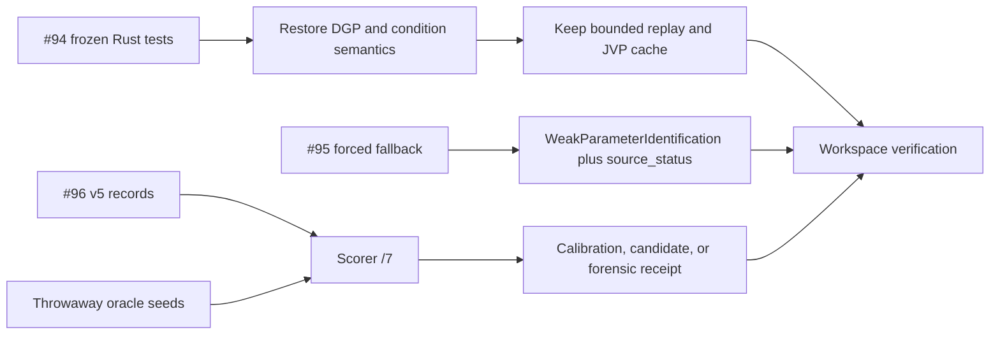

# Design: open-issue code fixes

## Overview

Three independent defects remain on `codex/move-temporal-field-gates-to-eo`. Issue #94 changed a
frozen spatial replay DGP and its conditioning policy in a commit that also added useful
performance work. Issue #95 drops an adjusted-variance failure cause during the exact fallback.
Issue #96 needs a successor scorer with explicit calibration, pairing, arithmetic, promotion,
and retention contracts before a future experiment can use it.

The frozen temporal v5 receipt and its scientific no-go remain unchanged.

## Goals

- Keep the bounded spatial replay and prepared phase-link linearization from `3a63b3a` while
  restoring the frozen raw inputs and statuses required by #94.
- Preserve the exact adjusted-variance failure as machine-readable provenance under the public
  `WeakParameterIdentification` status required by #95.
- Add a separate temporal scorer `/7` with explicit forensic and future-calibration modes that
  fixes all five #96 findings.
- Prove each fix with a red contract before production code changes.

## Non-goals

- Amend or rerun the frozen v5 temporal experiment.
- Certify a new temporal estimator, emit corrected inferential sigma, or reopen #53.
- Address the separate GDAL/HDF5 parallel-test crash.
- Merge, release, publish crates, bump GroundPulse, deploy, or make external scientific claims.

## Design

### #94: retain performance work and restore frozen semantics

Commit `7946b9a` proves that removing `3a63b3a` restores the three frozen workflow tests. It also
removes prepared eigensystem reuse, the bounded cell-parallel runner, process-tree RSS enforcement,
resume identity checks, and their contracts.

The final tree will retain those performance changes and restore two pre-`3a63b3a` behaviors:

1. Frozen attempts use `source_history(dgp_ordinal, ...)`. Cohort-level spatial-field generation
   cannot alter an existing attempt stream.
2. Fixed-L2 spatial propagation enforces the frozen `1e8` condition limit on the phase and date
   covariance stages. A date-only `1e12` limit changes seed 127 from `ill_conditioned` to `valid`.

The Python scorer, portable table, preregistration identity, and Python contracts will use the
same restored DGP and condition policy. Existing frozen Rust assertions remain the acceptance
contract; expected hashes and statuses stay frozen.

### #95: nested temporal failure provenance

`ComparatorDiagnostics` gains an optional `source_status`. Serialization omits the field when it
is absent, preserving existing successful records. The exact fallback carries the result of
`reml_covariance_parameter_adjusted_variance` as two values:

- adjusted variance when the calculation succeeds;
- the exact `TemporalInferenceStatus` when it fails.

`scalar_pair` continues to emit `WeakParameterIdentification` for the adjusted-scalar comparator
and writes the captured status to `source_status`. The estimator remains fail-closed. The committed
v5 no-go summary stays byte-identical.

### #96: successor temporal scorer

The v5 scorer lives inside `validation/temporal_covariance_simulation.py`, which is part of the
frozen producer source identity. A new `validation/score_temporal_covariance_synthetic_v7.py`
owns the corrected scorer. The v5 generator, preregistration, scorer tests, no-go summary, Rust
batch, and current Rust product validator remain unchanged.

The scorer exposes:

```python
score_records(records, policy, source_identity, mode)
```

Supported modes are:

- `oracle_calibration`: accepts only the throwaway seed domain and produces a hash-bound
  calibration receipt;
- `candidate_evaluation`: requires a passing calibration receipt and a disjoint seed domain;
- `forensic_v5`: produces the corrected diagnostic tables with
  `certification_eligible=false` and `retroactive_v5_certification=false`.

The scorer writes schema `coverage_bias_interval_score/7` and binds its source SHA, policy SHA,
source preregistration SHA, run manifest, run commit, mode, and calibration receipt where used.

#### Gate rules

- Bias uses 24 unique scientific cells. The policy freezes familywise alpha, standardized-bias
  tolerance, and a minimum scored count satisfying
  `K * 2 * P(T[n-1] > tolerance * sqrt(n)) <= alpha`. A count of 1,050 is rejected as
  uncalibrated. The throwaway oracle contract uses 5,000 observations per cell.
- Coverage uses integer ratios for the nominal level and tolerance. Boundary values such as
  `65/100` at `0.68 +/- 0.03` pass exactly.
- Emission uses integer arithmetic: `scored * 100 >= attempted * 99`.
- Each selected-versus-baseline comparison has its own intersection. The overlap floor is 98%,
  the union-bound floor for two methods that each meet 99% emission. The receipt retains paired,
  selected-only, baseline-only, and neither counts for each comparison.
- Candidate validity depends on selected-method cell gates and its named paired comparisons.
  Other estimators remain diagnostic. Oracle validity comes from the separate calibration
  receipt.
- Every receipt retains compact per-cell and per-method counts, bias moments, coverage counts,
  widths, interval scores, gate values, failing-gate names, and pairwise emission accounting.

## Flow



## Risks

- Selective restoration of `3a63b3a` can leave Rust and Python spatial identities inconsistent.
  The exact Rust command and Python validation suite gate completion.
- Adding `source_status` can change serialized records when a nested failure occurs. This is the
  intended forward-looking evidence change; successful records omit the field.
- A passing scorer `/7` receipt can establish instrument calibration under its frozen policy.
  Temporal-estimator viability still requires a new preregistration and unseen seeds.

## Open questions

None. The scientific no-go, immutable v5 boundary, and no-merge boundary remain fixed.
